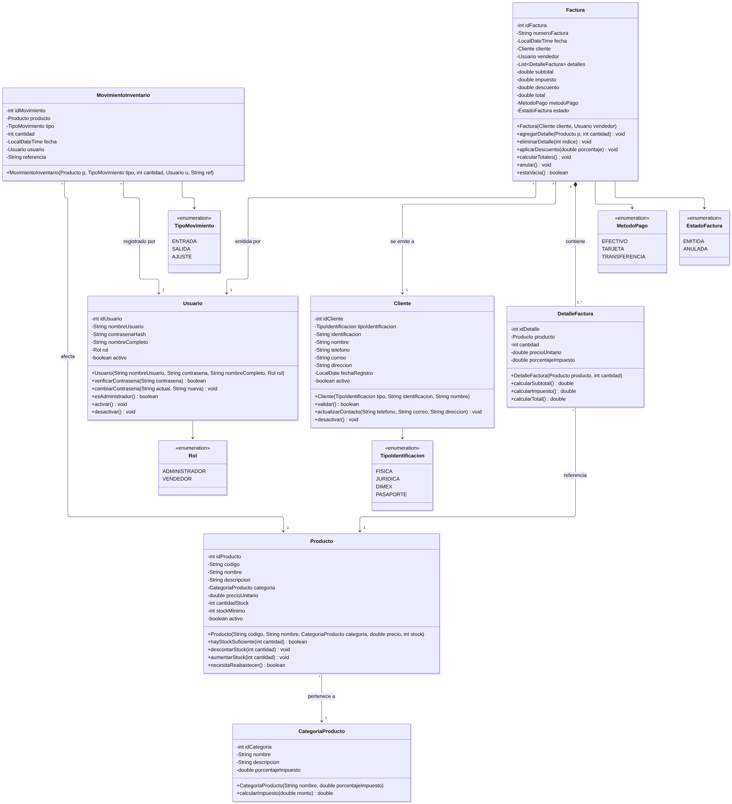

# 1. Introducción

La cadena de venta al por mayor **Fidecompro** necesita una aplicación de escritorio para llevar el inventario de sus productos y emitir facturas a sus clientes. Este documento presenta el diseño de la solución para el Avance 1 del proyecto final: las clases identificadas (con atributos, métodos y relaciones), las funcionalidades expresadas como historias de usuario y los prototipos de la interfaz gráfica.

## 1.1 Requerimientos del enunciado

| # | Requerimiento del enunciado | Historias de usuario que lo cubren |
|---|---|---|
| R1 | Creación de los registros de los clientes | HU-04, HU-05, HU-06 |
| R2 | Registro de los productos (varios tipos de productos) | HU-07, HU-08, HU-09, HU-10 |
| R3 | Crear facturas a los clientes | HU-11, HU-12, HU-14, HU-15 |
| R4 | Entregar la factura física (archivo con el desglose de pago) | HU-13 |
| R5 | Ingreso con usuario y contraseña | HU-01, HU-02, HU-03 |

## 1.2 Alcance y decisiones técnicas

* **Lenguaje y entorno:** Java 17, NetBeans IDE, interfaz gráfica con **Java Swing**. No se usa ningún framework; todo el código se escribe desde cero.
* **Arquitectura cliente-servidor:** un **servidor** central atiende a varias cajas (clientes Swing) al mismo tiempo mediante **sockets TCP**. Cada conexión es atendida por su propio hilo (`ManejadorCliente`) dentro de un pool de hilos.
* **Concurrencia:** cuando dos vendedores facturan el mismo producto a la vez, el servidor valida y descuenta el stock dentro de un bloque `synchronized`, de modo que nunca se venda más inventario del que existe. El número de factura se genera con un contador atómico (`AtomicInteger`) para que no se repita. En el cliente, las consultas largas se ejecutan con `SwingWorker` para no congelar la ventana.
* **Persistencia:** base de datos MySQL accedida con JDBC (API estándar de Java) a través de clases DAO.
* **Factura física:** el servidor genera un archivo `.txt` (y opcionalmente `.html`) con el desglose completo de la factura, que el usuario guarda o imprime.
* **Roles:** `ADMINISTRADOR` (gestiona usuarios, catálogo e inventario, puede anular facturas) y `VENDEDOR` (registra clientes y emite facturas).

# 2. Entidades y clases

Las clases se organizan en cuatro paquetes:

| Paquete | Contenido |
|---|---|
| `fidecompro.modelo` | Entidades del negocio (serializables, viajan entre cliente y servidor) |
| `fidecompro.servidor` | Servidor de sockets, hilos de atención, servicios y generador de archivos |
| `fidecompro.datos` | Conexión a la base de datos y clases DAO |
| `fidecompro.cliente` | Conexión del cliente y ventanas Swing |

## 2.1 Diagrama de clases del modelo de dominio

## 2.2 Descripción de las entidades del dominio

Todas las entidades implementan `Serializable` y tienen constructor vacío, *getters* y *setters* y `toString()`; en las tablas se listan solo los métodos con lógica propia.

### Usuario
Persona que ingresa al sistema (vendedor o administrador).

| Atributo | Tipo | Descripción |
|---|---|---|
| idUsuario | int | Identificador único |
| nombreUsuario | String | Nombre con el que inicia sesión (único) |
| contrasenaHash | String | Contraseña cifrada con SHA-256 (nunca se guarda en texto plano) |
| nombreCompleto | String | Nombre de la persona |
| rol | Rol | `ADMINISTRADOR` o `VENDEDOR` |
| activo | boolean | Un usuario inactivo no puede ingresar |

| Método | Descripción |
|---|---|
| verificarContrasena(String): boolean | Cifra la contraseña recibida y la compara con `contrasenaHash` |
| cambiarContrasena(String actual, String nueva): void | Valida la actual y guarda la nueva cifrada |
| esAdministrador(): boolean | Indica si puede entrar a los módulos restringidos |
| activar() / desactivar(): void | Habilita o bloquea el acceso |

**Relaciones:** un usuario emite muchas `Factura` (1 a \*) y registra muchos `MovimientoInventario` (1 a \*).

### Cliente
Comercio o persona a quien Fidecompro le vende.

| Atributo | Tipo | Descripción |
|---|---|---|
| idCliente | int | Identificador único |
| tipoIdentificacion | TipoIdentificacion | Física, jurídica, DIMEX o pasaporte |
| identificacion | String | Número de cédula o documento (único) |
| nombre | String | Nombre o razón social |
| telefono, correo, direccion | String | Datos de contacto |
| fechaRegistro | LocalDate | Fecha en que se creó el registro |
| activo | boolean | Los clientes inactivos no aparecen al facturar |

| Método | Descripción |
|---|---|
| validar(): boolean | Revisa campos obligatorios y formato de identificación y correo |
| actualizarContacto(String, String, String): void | Cambia teléfono, correo y dirección |
| desactivar(): void | Baja lógica (se conserva el historial de facturas) |

**Relaciones:** un cliente tiene muchas `Factura` (1 a \*).

### CategoriaProducto
Representa los **tipos de producto** que maneja la cadena (abarrotes, bebidas, limpieza, higiene, etc.). Cada tipo define su porcentaje de impuesto.

| Atributo | Tipo | Descripción |
|---|---|---|
| idCategoria | int | Identificador |
| nombre | String | Nombre del tipo de producto |
| descripcion | String | Descripción |
| porcentajeImpuesto | double | IVA aplicable (p. ej. 1 % canasta básica, 13 % general) |

| Método | Descripción |
|---|---|
| calcularImpuesto(double monto): double | Devuelve el impuesto sobre un monto |

**Relaciones:** una categoría agrupa muchos `Producto` (1 a \*).

### Producto
Artículo que se vende y cuyo inventario se controla.

| Atributo | Tipo | Descripción |
|---|---|---|
| idProducto | int | Identificador |
| codigo | String | Código interno único (p. ej. `ABR-0012`) |
| nombre, descripcion | String | Datos descriptivos |
| categoria | CategoriaProducto | Tipo de producto |
| precioUnitario | double | Precio de venta sin impuesto |
| cantidadStock | int | Existencias actuales |
| stockMinimo | int | Nivel a partir del cual se alerta reabastecer |
| activo | boolean | Si se puede vender |

| Método | Descripción |
|---|---|
| hayStockSuficiente(int): boolean | Indica si se puede vender la cantidad pedida |
| descontarStock(int): void | Resta existencias; lanza `StockInsuficienteException` si no alcanza |
| aumentarStock(int): void | Suma existencias (compras o devoluciones) |
| necesitaReabastecer(): boolean | `cantidadStock <= stockMinimo` |

**Relaciones:** pertenece a una `CategoriaProducto` (\* a 1); es referenciado por `DetalleFactura` y `MovimientoInventario`.

### MovimientoInventario
Bitácora de cada entrada, salida o ajuste de inventario, para saber quién cambió el stock y por qué.

| Atributo | Tipo | Descripción |
|---|---|---|
| idMovimiento | int | Identificador |
| producto | Producto | Producto afectado |
| tipo | TipoMovimiento | `ENTRADA`, `SALIDA` o `AJUSTE` |
| cantidad | int | Unidades movidas |
| fecha | LocalDateTime | Momento del movimiento |
| usuario | Usuario | Quién lo registró |
| referencia | String | Número de factura o motivo del ajuste |

### Factura
Documento de venta emitido a un cliente.

| Atributo | Tipo | Descripción |
|---|---|---|
| idFactura | int | Identificador interno |
| numeroFactura | String | Consecutivo visible (p. ej. `FC-000123`) |
| fecha | LocalDateTime | Fecha y hora de emisión |
| cliente | Cliente | A quién se factura |
| vendedor | Usuario | Quién la emite |
| detalles | List&lt;DetalleFactura&gt; | Líneas de la factura |
| subtotal, impuesto, descuento, total | double | Montos calculados |
| metodoPago | MetodoPago | Efectivo, tarjeta o transferencia |
| estado | EstadoFactura | `EMITIDA` o `ANULADA` |

| Método | Descripción |
|---|---|
| agregarDetalle(Producto, int): void | Agrega una línea (o suma cantidad si el producto ya está) y recalcula |
| eliminarDetalle(int): void | Quita una línea |
| aplicarDescuento(double): void | Aplica un porcentaje de descuento sobre el subtotal |
| calcularTotales(): void | Calcula subtotal, impuesto (según la categoría de cada producto) y total |
| anular(): void | Cambia el estado a `ANULADA` |
| estaVacia(): boolean | Impide emitir una factura sin líneas |

**Relaciones:** composición con `DetalleFactura` (1 a 1..*): las líneas no existen sin su factura. Asociación con `Cliente` y `Usuario` (\* a 1).

### DetalleFactura
Línea de una factura.

| Atributo | Tipo | Descripción |
|---|---|---|
| idDetalle | int | Identificador |
| producto | Producto | Producto vendido |
| cantidad | int | Unidades |
| precioUnitario | double | Precio al momento de la venta (se copia para conservar el histórico) |
| porcentajeImpuesto | double | IVA al momento de la venta |

| Método | Descripción |
|---|---|
| calcularSubtotal(): double | `cantidad × precioUnitario` |
| calcularImpuesto(): double | `subtotal × porcentajeImpuesto / 100` |
| calcularTotal(): double | Subtotal más impuesto |

### Enumeraciones
* `Rol`: ADMINISTRADOR, VENDEDOR.
* `TipoIdentificacion`: FISICA, JURIDICA, DIMEX, PASAPORTE.
* `TipoMovimiento`: ENTRADA, SALIDA, AJUSTE.
* `MetodoPago`: EFECTIVO, TARJETA, TRANSFERENCIA.
* `EstadoFactura`: EMITIDA, ANULADA.

## 2.3 Diagrama de clases cliente-servidor

Este diagrama muestra las clases que hacen funcionar la aplicación en red y de forma concurrente: las ventanas Swing, la conexión por sockets, el servidor con sus hilos, los servicios y el acceso a datos.

## 2.4 Descripción de las clases cliente-servidor

| Clase | Responsabilidad | Métodos principales | Relaciones |
|---|---|---|---|
| **ServidorFacturacion** | Abre un `ServerSocket` en el puerto 5000 y acepta conexiones; cada conexión se entrega a un pool de hilos (`ExecutorService`) | `iniciar()`, `detener()`, `aceptarConexiones()`, `main()` | Crea muchos `ManejadorCliente` (1 a \*) |
| **ManejadorCliente** (implementa `Runnable`) | Atiende a un cliente conectado en su propio hilo: lee `Solicitud`, llama al servicio correspondiente y responde con `Respuesta`. Guarda el usuario de la sesión para validar permisos | `run()`, `procesar(Solicitud)`, `cerrarConexion()` | Usa los cuatro servicios |
| **Solicitud** / **Respuesta** | Objetos serializables que viajan por el socket. La solicitud indica la operación (`TipoOperacion`) y los datos; la respuesta indica éxito, mensaje y datos | `getOperacion()`, `ok()`, `error()` | `Solicitud` usa `TipoOperacion` |
| **ServicioAutenticacion** | Valida credenciales, bloquea usuarios inactivos y registra usuarios nuevos | `iniciarSesion()`, `registrarUsuario()`, `cifrarContrasena()` | Usa `UsuarioDAO` |
| **ServicioClientes** | Reglas de negocio de clientes (identificación única, campos obligatorios) | `registrar()`, `actualizar()`, `buscar()`, `listar()` | Usa `ClienteDAO` |
| **ServicioInventario** | Catálogo y stock. **Sección crítica:** `reservarStock()` y `ajustarStock()` se sincronizan sobre un mismo candado para que dos hilos no descuenten el mismo producto a la vez | `registrarProducto()`, `ajustarStock()`, `reservarStock()`, `productosBajoMinimo()` | Usa `ProductoDAO` |
| **ServicioFacturacion** | Arma y guarda la factura, reserva el stock, asigna el consecutivo con `AtomicInteger` y genera el archivo | `crearFactura()`, `anularFactura()`, `listarFacturas()` | Usa `ServicioInventario`, `FacturaDAO`, `GeneradorArchivoFactura` |
| **GeneradorArchivoFactura** | Escribe la factura física con su desglose en `.txt` o `.html` usando `FileWriter`/`PrintWriter` | `generarTXT()`, `generarHTML()` | Usado por `ServicioFacturacion` |
| **ConexionBD** (Singleton) | Centraliza la URL y credenciales de MySQL y entrega conexiones JDBC | `getInstancia()`, `obtenerConexion()` | Usada por todos los DAO |
| **UsuarioDAO, ClienteDAO, ProductoDAO, FacturaDAO** | Ejecutan las sentencias SQL (`PreparedStatement`) de cada entidad | `insertar()`, `actualizar()`, `listar()`, `buscarPorId()`… | Dependen de `ConexionBD` |
| **ClienteSocket** | Del lado del cliente: abre el socket hacia el servidor y envía/recibe objetos | `conectar()`, `enviar(Solicitud)`, `desconectar()` | Usado por todas las ventanas |
| **VentanaLogin** (`JFrame`) | Pide usuario y contraseña; si son válidos abre la ventana principal | `btnIngresarActionPerformed()` | Abre `VentanaPrincipal` |
| **VentanaPrincipal** (`JFrame`) | Menú y pestañas de los módulos; oculta los módulos de administrador a los vendedores | `mostrarModulo()` | Contiene los paneles |
| **PanelClientes, PanelProductos, PanelFacturacion** (`JPanel`) | Pantallas de cada módulo | `cargarTabla()`, `guardar…()`, `emitirFactura()` | Usan `ClienteSocket` |
| **HiloActualizacionStock** (`SwingWorker`) | Refresca la tabla de inventario en segundo plano sin congelar la interfaz | `doInBackground()`, `done()` | Usado por `PanelProductos` |

## 2.5 Flujo concurrente de emisión de una factura

El siguiente diagrama de secuencia muestra cómo se emite una factura y dónde se controla la concurrencia.

# 3. Historias de usuario

Prioridad según MoSCoW (**Alta** = imprescindible para la entrega final). La estimación está en puntos de historia (1 = muy simple, 8 = compleja).

## Módulo de acceso

**HU-01 · Iniciar sesión**
*Como* vendedor o administrador, *quiero* ingresar a la aplicación con mi usuario y contraseña *para* que solo el personal autorizado pueda facturar y modificar el inventario.
Prioridad: Alta · Estimación: 3 · Pantalla: P1

* Si el usuario y la contraseña son correctos y el usuario está activo, se abre el menú principal mostrando el nombre y el rol.
* Si son incorrectos, se muestra "Usuario o contraseña incorrectos" sin indicar cuál de los dos falló.
* Tras 3 intentos fallidos seguidos, el botón *Ingresar* se bloquea durante 1 minuto.
* La contraseña se escribe en un campo oculto y viaja/se guarda cifrada.

**HU-02 · Cerrar sesión**
*Como* usuario, *quiero* cerrar mi sesión *para* que otra persona no use mi cuenta en la misma caja.
Prioridad: Alta · Estimación: 1 · Pantalla: P2

* Al cerrar sesión se libera la conexión con el servidor y se regresa a la pantalla de inicio de sesión.

**HU-03 · Administrar usuarios**
*Como* administrador, *quiero* crear, editar y desactivar usuarios con rol de vendedor o administrador *para* controlar quién tiene acceso al sistema.
Prioridad: Alta · Estimación: 5 · Pantalla: P8

* El nombre de usuario no se puede repetir.
* La contraseña debe tener al menos 8 caracteres y confirmarse.
* Un usuario desactivado no puede iniciar sesión, pero sus facturas se conservan.
* El módulo no es visible para usuarios con rol `VENDEDOR`.

## Módulo de clientes

**HU-04 · Registrar cliente**
*Como* vendedor, *quiero* registrar un cliente con tipo e identificación, nombre, teléfono, correo y dirección *para* poder emitirle facturas.
Prioridad: Alta · Estimación: 3 · Pantalla: P3

* Identificación, tipo de identificación y nombre son obligatorios.
* No se permite registrar dos clientes con la misma identificación.
* El correo se valida con formato `algo@dominio`.
* Al guardar, el cliente aparece de inmediato en la tabla.

**HU-05 · Buscar y editar cliente**
*Como* vendedor, *quiero* buscar un cliente por identificación o nombre y actualizar sus datos de contacto *para* mantener la información al día.
Prioridad: Alta · Estimación: 2 · Pantalla: P3

* La búsqueda acepta coincidencias parciales y no distingue mayúsculas.
* Al seleccionar una fila de la tabla, sus datos se cargan en el formulario.

**HU-06 · Desactivar cliente**
*Como* administrador, *quiero* desactivar un cliente *para* que no aparezca al facturar sin perder sus facturas anteriores.
Prioridad: Media · Estimación: 1 · Pantalla: P3

* Se pide confirmación antes de desactivar.

## Módulo de productos e inventario

**HU-07 · Administrar tipos de producto**
*Como* administrador, *quiero* crear categorías de producto (abarrotes, bebidas, limpieza, higiene…) con su porcentaje de impuesto *para* clasificar el catálogo y calcular bien el IVA.
Prioridad: Alta · Estimación: 2 · Pantalla: P4 (pestaña Categorías)

* El nombre de la categoría es único y el impuesto está entre 0 % y 13 %.

**HU-08 · Registrar producto**
*Como* administrador, *quiero* registrar un producto con código, nombre, categoría, precio, stock inicial y stock mínimo *para* poder venderlo y controlar sus existencias.
Prioridad: Alta · Estimación: 3 · Pantalla: P4

* El código es único; el precio debe ser mayor que 0 y el stock no puede ser negativo.
* Se puede filtrar la lista por categoría y buscar por código o nombre.

**HU-09 · Ajustar inventario**
*Como* administrador, *quiero* registrar entradas de mercadería y ajustes de inventario indicando el motivo *para* que el stock del sistema coincida con la bodega.
Prioridad: Alta · Estimación: 3 · Pantalla: P4 (diálogo Ajustar stock)

* Cada ajuste genera un `MovimientoInventario` con usuario, fecha, cantidad y motivo.
* Un ajuste no puede dejar el stock en negativo.

**HU-10 · Alertas de stock bajo**
*Como* administrador, *quiero* ver qué productos están por debajo del stock mínimo *para* reabastecerlos a tiempo.
Prioridad: Media · Estimación: 2 · Pantallas: P2 y P4

* El menú principal muestra cuántos productos están bajo el mínimo y cuáles.
* En la tabla de productos esos productos se marcan en rojo.
* La tabla se refresca en segundo plano cada 30 segundos sin bloquear la ventana.

## Módulo de facturación

**HU-11 · Crear factura**
*Como* vendedor, *quiero* seleccionar un cliente, agregar productos con su cantidad y elegir el método de pago *para* emitirle una factura.
Prioridad: Alta · Estimación: 8 · Pantalla: P5

* Al agregar un producto se muestran sus existencias disponibles; no se puede agregar una cantidad mayor.
* Si el producto ya está en la factura, se suma la cantidad en la misma línea.
* Subtotal, descuento, impuesto (según la categoría de cada producto) y total se recalculan en cada cambio.
* No se puede emitir una factura sin cliente o sin líneas.
* Al emitir, se asigna un número consecutivo único (`FC-000123`) y se descuenta el inventario.

**HU-12 · Facturación simultánea sin vender de más**
*Como* administrador, *quiero* que varias cajas puedan facturar al mismo tiempo sin que se venda más producto del que hay *para* que el inventario sea confiable.
Prioridad: Alta · Estimación: 5 · Pantalla: P5

* El servidor atiende a cada caja en un hilo distinto.
* Si dos cajas venden el último stock de un producto al mismo tiempo, solo una factura se emite; la otra recibe el mensaje "Stock insuficiente de &lt;producto&gt;" y puede corregir la cantidad.
* Dos facturas nunca reciben el mismo número.

**HU-13 · Generar factura física**
*Como* vendedor, *quiero* obtener la factura en un archivo con el desglose de pago *para* entregarla o imprimirla al cliente.
Prioridad: Alta · Estimación: 3 · Pantalla: P6

* El archivo incluye: datos de Fidecompro, número y fecha, vendedor, datos del cliente, cada línea (cantidad, descripción, precio unitario, total), subtotal, descuento, IVA, total y método de pago.
* Se guarda como `FC-000123.txt` (u `.html`) en la carpeta que elija el usuario.
* Se muestra una vista previa antes de guardar.

**HU-14 · Consultar historial de facturas**
*Como* vendedor o administrador, *quiero* consultar las facturas por rango de fechas, cliente y estado *para* dar seguimiento a las ventas.
Prioridad: Media · Estimación: 3 · Pantalla: P7

* Se muestra el total vendido del periodo (solo facturas emitidas).
* Desde el historial se puede ver el detalle y volver a generar el archivo.

**HU-15 · Anular factura**
*Como* administrador, *quiero* anular una factura emitida por error *para* corregir las ventas y devolver el producto al inventario.
Prioridad: Media · Estimación: 3 · Pantalla: P7

* Solo el rol administrador puede anular.
* Al anular, el estado pasa a `ANULADA` y el stock de cada línea se devuelve con un movimiento de tipo `ENTRADA`.
* Una factura anulada no se puede volver a anular.

## Resumen

| ID | Historia | Rol | Prioridad | Puntos | Pantalla |
|---|---|---|---|---|---|
| HU-01 | Iniciar sesión | Todos | Alta | 3 | P1 |
| HU-02 | Cerrar sesión | Todos | Alta | 1 | P2 |
| HU-03 | Administrar usuarios | Administrador | Alta | 5 | P8 |
| HU-04 | Registrar cliente | Vendedor | Alta | 3 | P3 |
| HU-05 | Buscar y editar cliente | Vendedor | Alta | 2 | P3 |
| HU-06 | Desactivar cliente | Administrador | Media | 1 | P3 |
| HU-07 | Administrar tipos de producto | Administrador | Alta | 2 | P4 |
| HU-08 | Registrar producto | Administrador | Alta | 3 | P4 |
| HU-09 | Ajustar inventario | Administrador | Alta | 3 | P4 |
| HU-10 | Alertas de stock bajo | Administrador | Media | 2 | P2, P4 |
| HU-11 | Crear factura | Vendedor | Alta | 8 | P5 |
| HU-12 | Facturación simultánea | Administrador | Alta | 5 | P5 |
| HU-13 | Generar factura física | Vendedor | Alta | 3 | P6 |
| HU-14 | Historial de facturas | Todos | Media | 3 | P7 |
| HU-15 | Anular factura | Administrador | Media | 3 | P7 |

# 4. Prototipos de interfaz gráfica

Los prototipos representan las ventanas Swing de la aplicación final (look and feel Nimbus). Se elaboraron como maquetas HTML/CSS, incluidas en `docs/prototipos/html/`, y se exportaron a imagen. Los datos mostrados son de ejemplo.

## 4.1 Mapa de navegación

## 4.2 P1 · Inicio de sesión (HU-01)

Campos de usuario y contraseña (oculta), dirección del servidor y mensaje de error ante credenciales inválidas.

## 4.3 P2 · Menú principal (HU-02, HU-10)

Acceso a todos los módulos mediante menú y botones, resumen del día y alerta de productos bajo el stock mínimo. La barra de estado muestra el usuario, su rol y el estado de la conexión. El botón *Usuarios* solo aparece para administradores.

## 4.4 P3 · Gestión de clientes (HU-04, HU-05, HU-06)

Formulario de registro y edición, búsqueda y tabla de clientes.

## 4.5 P4 · Productos e inventario (HU-07, HU-08, HU-09, HU-10)

Pestañas para productos, categorías (tipos de producto) y movimientos de inventario. Los productos bajo el mínimo se resaltan en rojo.

## 4.6 P5 · Nueva factura (HU-11, HU-12)

Selección de cliente, agregado de productos con validación de existencias, tabla de líneas con el IVA de cada tipo de producto, método de pago, descuento y totales calculados.

## 4.7 P6 · Vista previa de la factura física (HU-13)

Contenido exacto del archivo que se genera, con el desglose de pago, y botones para guardarlo como `.txt` o `.html`.

## 4.8 P7 · Historial de facturas (HU-14, HU-15)

Filtros por fecha, cliente y estado; total del periodo y acciones para ver el detalle, regenerar el archivo o anular.

## 4.9 P8 · Gestión de usuarios (HU-03)

Exclusiva del administrador: alta, edición, cambio de rol, restablecimiento de contraseña y desactivación de usuarios.

# 5. Trazabilidad historias – clases – pantallas

| Historia | Clases principales | Pantalla |
|---|---|---|
| HU-01, HU-02 | Usuario, ServicioAutenticacion, UsuarioDAO, VentanaLogin, ClienteSocket | P1, P2 |
| HU-03 | Usuario, Rol, ServicioAutenticacion, UsuarioDAO | P8 |
| HU-04 a HU-06 | Cliente, ServicioClientes, ClienteDAO, PanelClientes | P3 |
| HU-07, HU-08 | CategoriaProducto, Producto, ServicioInventario, ProductoDAO, PanelProductos | P4 |
| HU-09, HU-10 | Producto, MovimientoInventario, ServicioInventario, HiloActualizacionStock | P2, P4 |
| HU-11, HU-12 | Factura, DetalleFactura, ServicioFacturacion, ServicioInventario, ManejadorCliente, PanelFacturacion | P5 |
| HU-13 | Factura, GeneradorArchivoFactura | P6 |
| HU-14, HU-15 | Factura, EstadoFactura, FacturaDAO, MovimientoInventario | P7 |
