**Control de versiones**

| Versión | Fecha | Cambios |
|---|---|---|
| v1 | 06/10/2026 | Primera versión: clases, 15 historias de usuario, 8 prototipos y diagramas de arquitectura, secuencia y navegación |
| v2 | 08/10/2026 | Modelo de clases ajustado al material de las semanas 1 a 5 (estilo MultiSports); tabla de temas del curso; hilos, sockets, Swing y BD como arquitectura prevista; historias y prototipo de productos por tipo |
| v3 | 08/10/2026 | Se agrega esta tabla de control de versiones y la versión en el nombre del archivo |
| v4 | 08/10/2026 | Historias de usuario en formato de tabla con escenarios de aceptación (Dado que / Cuando / Resultado esperado) |
| v5 | 08/10/2026 | Se agregan las listas de requerimientos funcionales (10) y no funcionales (8); las secciones siguientes se renumeran |
| v6 | 08/10/2026 | Diseño alineado con lo que el profesor pide para el proyecto final: CRUD completo (con eliminar) desde pantallas, ventana del servidor (HU 16 y P9), base de datos MySQL o Derby con su modelo de tablas y plan de demostración para el video final |
| v7 | 08/10/2026 | Guía al inicio con las tres partes que pide el Avance 1 (historias de usuario, diagrama de clases y bocetos); tabla de pantallas CRUD por clase; nuevo boceto P10 de categorías; nombre del profesor en la portada |

# 1. Introducción

La cadena de venta al por mayor **Fidecompro** necesita una aplicación de escritorio para llevar el inventario de sus productos y emitir facturas a sus clientes. Este documento presenta el diseño de la solución para el Avance 1 del proyecto final: las clases identificadas (con atributos, métodos y relaciones), las funcionalidades expresadas como historias de usuario y los prototipos de la interfaz gráfica.

**Contenido del Avance 1.** El Avance 1 es conceptual y pide tres partes. Esta tabla indica dónde está cada una; el resto del documento (requerimientos, arquitectura, base de datos y plan de demostración) las complementa.

| Parte pedida | Dónde está | Qué contiene |
|---|---|---|
| **Historias de usuario** | Sección 5 | 16 historias con su rol, funcionalidad, finalidad y escenarios de aceptación |
| **Diagrama de clases** | Secciones 4.1 y 4.3 | Clases del sistema con atributos, métodos y relaciones; la sección 4.2 describe cada clase |
| **Bocetos (mockups) de las pantallas** | Sección 6 | Inicio de sesión, menú principal y pantallas CRUD de cada clase (clientes, productos, categorías, usuarios y facturas), más la ventana del servidor |

## 1.1 Requerimientos del enunciado

| # | Requerimiento del enunciado | Historias de usuario que lo cubren |
|---|---|---|
| R1 | Creación de los registros de los clientes | HU 4, HU 5, HU 6 |
| R2 | Registro de los productos (varios tipos de productos) | HU 7, HU 8, HU 9, HU 10 |
| R3 | Crear facturas a los clientes | HU 11, HU 12, HU 14, HU 15 |
| R4 | Entregar la factura física (archivo con el desglose de pago) | HU 13 |
| R5 | Ingreso con usuario y contraseña | HU 1, HU 2, HU 3 |

## 1.2 Requisitos del proyecto final

El profesor indicó que el proyecto final debe cumplir cuatro requisitos técnicos y demostrarse en un video. Aunque varios temas todavía no se han visto en el curso, el diseño de este avance ya los contempla para no tener que rehacerlo después:

| Requisito del proyecto final | Cómo lo cumple el diseño | Dónde |
|---|---|---|
| Cliente-servidor con **sockets** | Cada caja es una aplicación cliente que se conecta por `Socket` al `ServerSocket` del servidor (puerto 5000) e intercambia objetos `Solicitud` y `Respuesta` | Secciones 4.3 y 4.4 |
| **Hilos** | El servidor atiende cada cliente conectado en su propio hilo (`ManejadorCliente`); las operaciones que modifican datos se sincronizan | Secciones 4.4 y 4.5 |
| Pantallas **JFrame** | Ventanas Swing para el cliente (P1 a P8 y P10) y una ventana propia del servidor (P9) | Sección 6 |
| Base de datos **MySQL o Derby** | Todo se guarda en la base de datos por medio de JDBC y clases DAO | Sección 4.6 |
| **CRUD** completo desde pantallas | Crear, consultar, modificar y eliminar usuarios, clientes, categorías y productos; crear, consultar y anular facturas | Secciones 2 y 8 |
| Varios clientes a la vez | Se pueden abrir varias ventanas cliente al mismo tiempo y el servidor las atiende en paralelo | HU 12, HU 16 |
| Video final | Guion de demostración de todas las funcionalidades | Sección 8 |

## 1.3 Alcance y decisiones técnicas

* **Lenguaje y entorno:** Java 17, proyecto Maven en NetBeans IDE, interfaz gráfica con **Java Swing** (ventanas `JFrame` diseñadas en NetBeans). No se usa ningún framework; todo el código se escribe desde cero.
* **Base del diseño:** el modelo de clases (sección 4) aplica lo visto en las semanas 1 a 5: herencia, clases abstractas, interfaces, polimorfismo, colecciones y excepciones propias. Hilos, sockets, pantallas JFrame y base de datos aún no se han visto en el curso; se incluyen como **arquitectura prevista**, porque son obligatorios en el proyecto final, y se detallarán en los siguientes avances.
* **Arquitectura cliente-servidor:** un **servidor** central atiende a varias cajas (clientes JFrame) al mismo tiempo mediante **sockets TCP**. Cada conexión es atendida por su propio hilo (`ManejadorCliente`) dentro de un pool de hilos. El servidor tiene su propia ventana (`VentanaServidor`) para iniciarlo, detenerlo y ver los clientes conectados y cada operación que atiende.
* **Concurrencia:** cuando dos vendedores facturan el mismo producto a la vez, el servidor valida y descuenta el stock dentro de un bloque `synchronized`, de modo que nunca se venda más inventario del que existe. El número de factura sale del contador `static Factura.ultimoNumero`, que se incrementa dentro de un método `synchronized` para que dos facturas nunca reciban el mismo número. Las demás operaciones que modifican datos (crear, modificar y eliminar) también se sincronizan en el servidor. En el cliente, las consultas largas se ejecutan con `SwingWorker` para no congelar la ventana, y cada pantalla tiene el botón *Actualizar lista* para ver los cambios hechos desde otras cajas.
* **Persistencia:** base de datos **MySQL** accedida con JDBC (API estándar de Java) a través de clases DAO. Como alternativa se puede usar **Apache Derby**, la otra base de datos que se verá en el curso: las sentencias SQL son las mismas y solo cambia la URL de conexión en `ConexionBD`.
* **Eliminar sin perder historial:** usuarios, clientes, categorías y productos se pueden eliminar desde su pantalla. Si un registro ya está en una factura (un cliente con compras, por ejemplo), el sistema no lo borra para no dañar el historial; lo desactiva y lo explica al usuario.
* **Factura física:** el servidor genera un archivo `.txt` (y opcionalmente `.html`) con el desglose completo de la factura, que el usuario guarda o imprime.
* **Roles:** `ADMINISTRADOR` (gestiona usuarios, catálogo e inventario, puede anular facturas) y `VENDEDOR` (registra clientes y emite facturas).

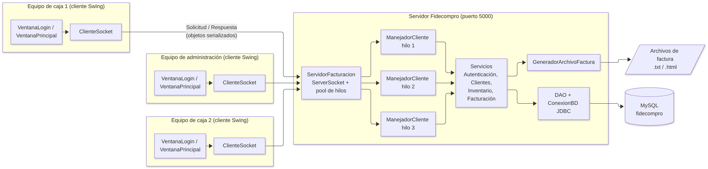

# 2. Lista de requerimientos funcionales

Los requerimientos funcionales describen lo que el sistema debe hacer. Cada uno indica las historias de usuario que lo detallan (sección 5).

TABLA_REQUERIMIENTOS_FUNCIONALES

# 3. Lista de requerimientos no funcionales

Los requerimientos no funcionales describen cómo debe comportarse el sistema y las condiciones técnicas que debe cumplir.

TABLA_REQUERIMIENTOS_NO_FUNCIONALES

# 4. Entidades y clases

El modelo de clases sigue la forma de trabajo vista en las semanas 1 a 5 del curso, en particular la práctica integradora MultiSports de la semana 5:

| Concepto del curso | Dónde se aplica en Fidecompro |
|---|---|
| Clase abstracta con subclases que sobrescriben un método (semanas 2 y 3) | `Producto` → `Abarrote`, `Bebida`, `ArticuloHogar`; `Persona` → `Usuario`, `Cliente` |
| Interface terminada en *-able* con `mostrarInformacion()` (semanas 3 y 5) | `Mostrable`, implementada por personas, productos, facturas y detalles |
| Polimorfismo: distintos objetos responden distinto al mismo mensaje (semana 3) | Cada tipo de producto responde `obtenerPorcentajeImpuesto()` a su manera |
| Atributos `static` e IDs autoincrementales (semanas 1 y 5) | `idAutoIncremental` en `Producto`, `Categoria`, `Cliente` y `Usuario`; `Factura.ultimoNumero` |
| Constantes `final` (semana 1, ejemplo del IVA) | `Producto.IVA_GENERAL = 0.13` y `Abarrote.IVA_CANASTA_BASICA = 0.01` |
| Composición y agregación con `ArrayList<T>` (semanas 1 y 5) | `Factura` *contiene* sus `DetalleFactura`; `Inventario` agrupa `Categoria` y `Categoria` agrupa `Producto` |
| Métodos `agregarX / editarX / eliminarX / mostrarX` por id (semana 5) | `Inventario`, `Categoria`, `RegistroClientes`, `RegistroUsuarios`, `RegistroFacturas` |
| Enumeraciones para catálogos cerrados (semana 1) | `Rol`, `TipoIdentificacion`, `MetodoPago`, `EstadoFactura` |
| `Comparable` y `Comparator` (semana 4) | `Producto implements Comparable<Producto>` (orden por nombre) y `ComparadorPorExistencias` |
| Excepciones propias y `try/catch/finally` (semana 4) | `StockInsuficienteException`, `CredencialesInvalidasException`, `RegistroNoEncontradoException`; `IOException` al escribir la factura |

Las clases se organizan en paquetes de un proyecto Maven de NetBeans:

| Paquete | Contenido |
|---|---|
| `com.fidecompro.modelo` | Entidades, enumeraciones, interface `Mostrable` y clases que administran colecciones (`Inventario`, `Registro…`) |
| `com.fidecompro.excepciones` | Excepciones propias del negocio |
| `com.fidecompro.servidor` | Servidor de sockets, hilos de atención y servicios (arquitectura prevista, sección 4.3) |
| `com.fidecompro.datos` | Conexión a la base de datos y clases DAO (arquitectura prevista) |
| `com.fidecompro.cliente` | Conexión del cliente y ventanas Swing (arquitectura prevista) |

## 4.1 Diagramas de clases del modelo de dominio

El modelo se presenta en dos diagramas para que se lea con claridad. El primero cubre el inventario, los tipos de producto y las excepciones; el segundo, las personas y la facturación.

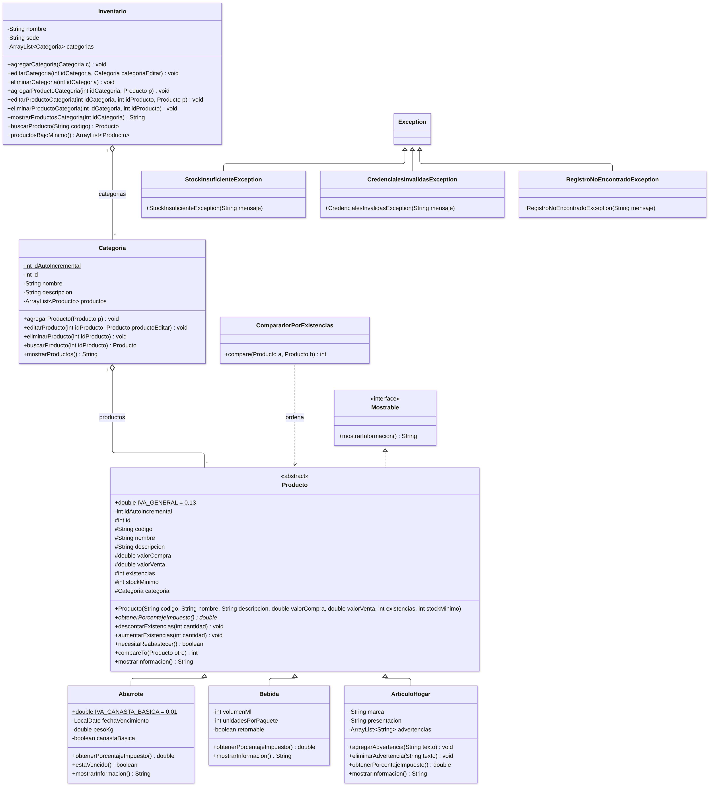

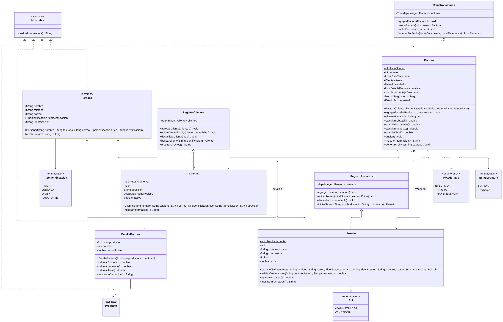

## 4.2 Descripción de las clases del dominio

Todas las clases tienen constructor con sus campos, *getters* y *setters*. En las tablas se listan solo los métodos con lógica propia.

### Mostrable (interface)
Contrato que obliga a cada objeto a describirse a sí mismo como texto. Se usa para listar en pantalla y para armar la factura física.

| Método | Descripción |
|---|---|
| mostrarInformacion(): String | Devuelve la información del objeto lista para mostrar o imprimir |

### Persona (abstracta)
Datos comunes de quien usa el sistema y de a quien se le vende. No se instancia directamente. Implementa `Mostrable`.

| Atributo | Tipo | Descripción |
|---|---|---|
| nombre | String | Nombre completo o razón social |
| telefono | String | Teléfono de contacto |
| correo | String | Correo electrónico |

**Relaciones:** superclase de `Usuario` y `Cliente` (herencia jerárquica).

### Usuario (extends Persona)
Persona que ingresa al sistema: vendedor o administrador.

| Atributo | Tipo | Descripción |
|---|---|---|
| idAutoIncremental | static int | Contador de la clase para asignar el siguiente id |
| id | int | Identificador asignado en el constructor |
| nombreUsuario | String | Nombre con el que inicia sesión (único) |
| contrasena | String | Contraseña de acceso |
| rol | Rol | `ADMINISTRADOR` o `VENDEDOR` |
| activo | boolean | Un usuario inactivo no puede ingresar |

| Método | Descripción |
|---|---|
| validarCredenciales(String, String): boolean | Compara usuario y contraseña con los suyos y revisa que esté activo |
| esAdministrador(): boolean | Indica si puede entrar a los módulos restringidos |
| mostrarInformacion(): String | Sobrescribe el de `Persona` agregando usuario y rol |

**Relaciones:** emite muchas `Factura` (1 a \*); lo administra `RegistroUsuarios`.

### Cliente (extends Persona)
Comercio o persona a quien Fidecompro le vende.

| Atributo | Tipo | Descripción |
|---|---|---|
| idAutoIncremental | static int | Contador de la clase |
| id | int | Identificador |
| tipoIdentificacion | TipoIdentificacion | Física, jurídica, DIMEX o pasaporte |
| identificacion | String | Número de cédula o documento (único) |
| direccion | String | Dirección de entrega |
| fechaRegistro | LocalDate | Fecha en que se creó el registro |
| activo | boolean | Los clientes inactivos no aparecen al facturar |

| Método | Descripción |
|---|---|
| mostrarInformacion(): String | Sobrescribe el de `Persona` agregando identificación y dirección |

**Relaciones:** tiene muchas `Factura` (1 a \*); lo administra `RegistroClientes`.

### Producto (abstracta)
Representa cualquier artículo que vende la cadena. Como el enunciado indica que Fidecompro maneja **varios tipos de productos**, cada tipo es una subclase, igual que `Pelota`, `Bate` y `EquipoDeAnotacion` en la práctica MultiSports. Implementa `Mostrable` y `Comparable<Producto>`.

| Atributo | Tipo | Descripción |
|---|---|---|
| IVA_GENERAL | static final double | Constante `0.13` (tarifa general del IVA) |
| idAutoIncremental | static int | Contador de la clase |
| id | int | Identificador |
| codigo | String | Código interno único (p. ej. `ABR-0012`) |
| nombre, descripcion | String | Datos descriptivos |
| valorCompra | double | Costo al que Fidecompro compra el producto |
| valorVenta | double | Precio de venta sin impuesto |
| existencias | int | Unidades disponibles |
| stockMinimo | int | Nivel a partir del cual se alerta reabastecer |
| categoria | Categoria | Categoría a la que pertenece |

| Método | Descripción |
|---|---|
| obtenerPorcentajeImpuesto(): double | **Abstracto.** Cada tipo de producto define su impuesto (polimorfismo) |
| descontarExistencias(int): void | Resta unidades; lanza `StockInsuficienteException` si no alcanzan |
| aumentarExistencias(int): void | Suma unidades (compras, ajustes o facturas anuladas) |
| necesitaReabastecer(): boolean | `existencias <= stockMinimo` |
| compareTo(Producto): int | Orden natural por nombre, para listar el catálogo con `Collections.sort` |
| mostrarInformacion(): String | Código, nombre, precio y existencias |

**Relaciones:** superclase de `Abarrote`, `Bebida` y `ArticuloHogar`; agregado en `Categoria` (\* a 1); referenciado por `DetalleFactura`.

### Abarrote, Bebida y ArticuloHogar (extends Producto)

| Subclase | Atributos propios | Impuesto (`obtenerPorcentajeImpuesto`) | Métodos propios |
|---|---|---|---|
| **Abarrote** (arroz, frijoles, aceite, café…) | `fechaVencimiento: LocalDate`, `pesoKg: double`, `canastaBasica: boolean`; constante `IVA_CANASTA_BASICA = 0.01` | 1 % si es canasta básica, si no `IVA_GENERAL` | `estaVencido(): boolean` |
| **Bebida** (refrescos, jugos, agua) | `volumenMl: int`, `unidadesPorPaquete: int`, `retornable: boolean` | `IVA_GENERAL` | — |
| **ArticuloHogar** (limpieza e higiene) | `marca: String`, `presentacion: String`, `advertencias: ArrayList<String>` | `IVA_GENERAL` | `agregarAdvertencia(String)`, `eliminarAdvertencia(String)` |

Las tres sobrescriben `mostrarInformacion()` llamando a `super.mostrarInformacion()` y agregando sus datos propios.

### Categoria
Agrupa productos para ordenar el catálogo (Abarrotes, Bebidas, Limpieza, Higiene…), igual que en MultiSports.

| Atributo | Tipo | Descripción |
|---|---|---|
| idAutoIncremental | static int | Contador de la clase |
| id | int | Identificador |
| nombre, descripcion | String | Datos de la categoría |
| productos | ArrayList&lt;Producto&gt; | Productos de la categoría |

| Método | Descripción |
|---|---|
| agregarProducto(Producto): void | Agrega un producto y le asigna esta categoría |
| editarProducto(int idProducto, Producto): void | Reemplaza los datos del producto con ese id |
| eliminarProducto(int idProducto): void | Quita el producto; lanza `RegistroNoEncontradoException` si no existe |
| buscarProducto(int idProducto): Producto | Busca por id |
| mostrarProductos(): String | Une el `mostrarInformacion()` de cada producto |

**Relaciones:** agregación con `Producto` (1 a \*); agregada en `Inventario`.

### Inventario
Punto central del catálogo de una sede.

| Atributo | Tipo | Descripción |
|---|---|---|
| nombre | String | Nombre del inventario |
| sede | String | Sucursal de Fidecompro |
| categorias | ArrayList&lt;Categoria&gt; | Categorías registradas |

| Método | Descripción |
|---|---|
| agregarCategoria / editarCategoria / eliminarCategoria | CRUD de categorías por id |
| agregarProductoCategoria(int idCategoria, Producto) | Agrega un producto en la categoría indicada |
| editarProductoCategoria / eliminarProductoCategoria | Edita o elimina un producto dentro de una categoría |
| mostrarProductosCategoria(int idCategoria): String | Lista los productos de una categoría |
| buscarProducto(String codigo): Producto | Busca en todas las categorías; se usa al facturar |
| productosBajoMinimo(): ArrayList&lt;Producto&gt; | Productos con `necesitaReabastecer()`, ordenados con `ComparadorPorExistencias` |

### ComparadorPorExistencias (implements Comparator&lt;Producto&gt;)
Orden alterno al natural: de menos a más existencias, para mostrar primero lo que urge reabastecer.

### Factura
Documento de venta emitido a un cliente. Implementa `Mostrable`.

| Atributo | Tipo | Descripción |
|---|---|---|
| ultimoNumero | static int | Último consecutivo usado (como `Factura.ultimoNumero` en el ejemplo de la semana 1) |
| numero | int | Consecutivo de esta factura (se muestra como `FC-000123`) |
| fecha | LocalDateTime | Fecha y hora de emisión |
| cliente | Cliente | A quién se factura |
| vendedor | Usuario | Quién la emite |
| detalles | ArrayList&lt;DetalleFactura&gt; | Líneas de la factura |
| porcentajeDescuento | double | Descuento aplicado al subtotal |
| metodoPago | MetodoPago | Efectivo, tarjeta o transferencia |
| estado | EstadoFactura | `EMITIDA` o `ANULADA` |

| Método | Descripción |
|---|---|
| agregarDetalle(Producto, int): void | Crea la línea; si el producto ya está, suma la cantidad. Lanza `StockInsuficienteException` |
| eliminarDetalle(int): void | Quita una línea |
| calcularSubtotal / calcularDescuento / calcularImpuesto / calcularTotal | Recorren `detalles` y suman; el impuesto de cada línea lo da su producto (polimorfismo) |
| anular(): void | Cambia el estado a `ANULADA` |
| mostrarInformacion(): String | Arma el desglose completo de la factura como texto |
| generarArchivo(String carpeta): void | Escribe `mostrarInformacion()` en `FC-000123.txt` con `FileWriter`, manejando `IOException` con `try/catch/finally` |

**Relaciones:** **composición** con `DetalleFactura` (1 a 1..\*): las líneas no existen sin su factura. Asociación con `Cliente` y `Usuario` (\* a 1). La administra `RegistroFacturas`.

### DetalleFactura
Línea de una factura. Implementa `Mostrable`.

| Atributo | Tipo | Descripción |
|---|---|---|
| producto | Producto | Producto vendido |
| cantidad | int | Unidades |
| precioUnitario | double | Copia del `valorVenta` al momento de la venta, para conservar el histórico |

| Método | Descripción |
|---|---|
| calcularSubtotal(): double | `cantidad × precioUnitario` |
| calcularImpuesto(): double | `subtotal × producto.obtenerPorcentajeImpuesto()` |
| calcularTotal(): double | Subtotal más impuesto |
| mostrarInformacion(): String | Una línea del desglose: cantidad, descripción, precio y total |

### RegistroUsuarios, RegistroClientes y RegistroFacturas
Clases que administran las colecciones, con el mismo patrón de `Inventario`.

| Clase | Atributo | Métodos |
|---|---|---|
| **RegistroUsuarios** | `usuarios: ArrayList<Usuario>` | `agregarUsuario`, `editarUsuario`, `eliminarUsuario`, `desactivarUsuario`, `iniciarSesion(nombreUsuario, contrasena)` que devuelve el `Usuario` o lanza `CredencialesInvalidasException` |
| **RegistroClientes** | `clientes: ArrayList<Cliente>` | `agregarCliente` (rechaza identificaciones repetidas), `editarCliente`, `eliminarCliente`, `desactivarCliente`, `buscarCliente(identificacion)`, `mostrarClientes` |
| **RegistroFacturas** | `facturas: ArrayList<Factura>` | `agregarFactura`, `buscarFactura(numero)`, `anularFactura(numero)` (devuelve las existencias al inventario), `facturasPorFecha(desde, hasta)`, `tieneFacturasCliente(idCliente)` y `tieneFacturasUsuario(idUsuario)` (se consultan antes de eliminar) |

### Excepciones propias (extends Exception)

| Excepción | Cuándo se lanza |
|---|---|
| StockInsuficienteException | Se intenta facturar o descontar más unidades de las que hay |
| CredencialesInvalidasException | Usuario o contraseña incorrectos, o usuario inactivo |
| RegistroNoEncontradoException | Se busca, edita o elimina un id o identificación que no existe |

### Enumeraciones
* `Rol`: ADMINISTRADOR, VENDEDOR.
* `TipoIdentificacion`: FISICA, JURIDICA, DIMEX, PASAPORTE.
* `MetodoPago`: EFECTIVO, TARJETA, TRANSFERENCIA.
* `EstadoFactura`: EMITIDA, ANULADA.

## 4.3 Diagrama de clases cliente-servidor

Este diagrama es la **arquitectura prevista** para los siguientes avances, cuando el curso cubra hilos, sockets, pantallas JFrame y bases de datos. Muestra las clases que harán funcionar la aplicación en red y de forma concurrente sobre el modelo de la sección 4.1: las ventanas del cliente y del servidor, la conexión por sockets, el servidor con sus hilos, los servicios y el acceso a datos. La enumeración `TipoOperacion` incluye las cuatro operaciones del CRUD de cada entidad.

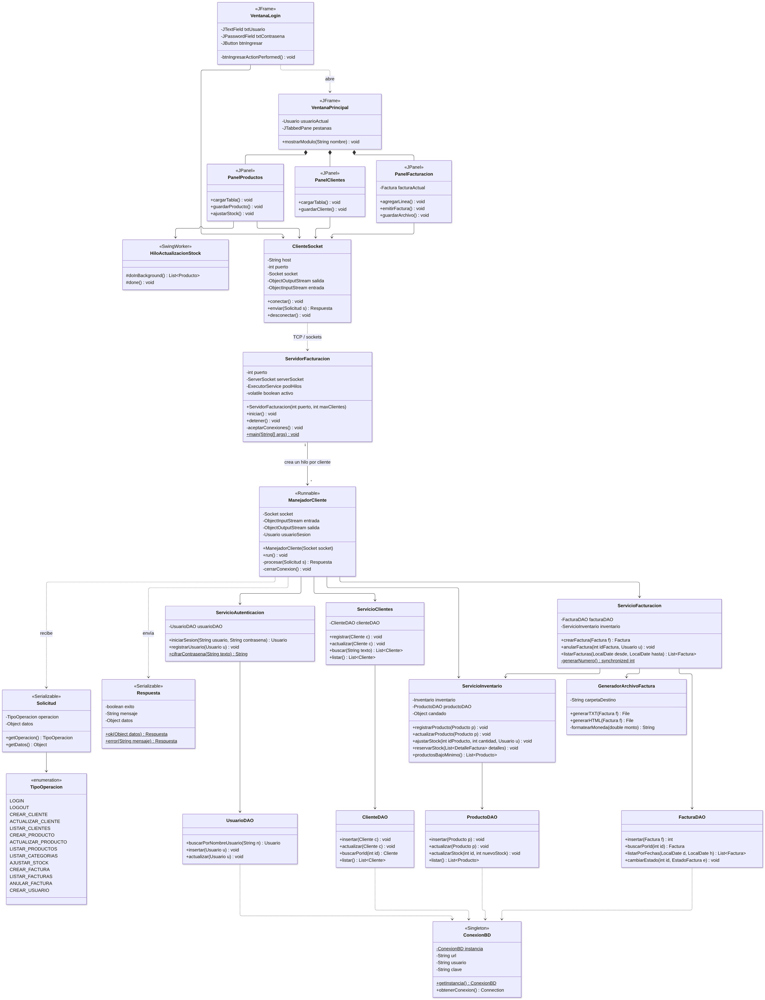

## 4.4 Descripción de las clases cliente-servidor

| Clase | Responsabilidad | Métodos principales | Relaciones |
|---|---|---|---|
| **VentanaServidor** (`JFrame`) | Pantalla del servidor: puerto, botones Iniciar y Detener, tabla de clientes conectados y bitácora de operaciones | `agregarCliente()`, `quitarCliente()`, `agregarBitacora()` | Inicia y detiene `ServidorFacturacion` |
| **ServidorFacturacion** | Abre un `ServerSocket` en el puerto 5000 y acepta conexiones; cada conexión se entrega a un pool de hilos (`ExecutorService`). Lleva la lista de clientes conectados y avisa a la ventana de cada operación | `iniciar()`, `detener()`, `aceptarConexiones()`, `registrarOperacion()`, `main()` | Crea muchos `ManejadorCliente` (1 a \*) |
| **ManejadorCliente** (implementa `Runnable`) | Atiende a un cliente conectado en su propio hilo: lee `Solicitud`, llama al servicio correspondiente y responde con `Respuesta`. Guarda el usuario de la sesión para validar permisos | `run()`, `procesar(Solicitud)`, `cerrarConexion()` | Usa los cuatro servicios |
| **Solicitud** / **Respuesta** | Objetos serializables que viajan por el socket. La solicitud indica la operación (`TipoOperacion`) y los datos; la respuesta indica éxito, mensaje y datos | `getOperacion()`, `ok()`, `error()` | `Solicitud` usa `TipoOperacion` |
| **ServicioAutenticacion** | Valida credenciales, bloquea usuarios inactivos y registra usuarios nuevos | `iniciarSesion()`, `registrarUsuario()`, `actualizarUsuario()`, `eliminarUsuario()`, `cifrarContrasena()` | Usa `UsuarioDAO` |
| **ServicioClientes** | Reglas de negocio de clientes (identificación única, campos obligatorios, no eliminar clientes con facturas) | `registrar()`, `actualizar()`, `eliminar()`, `buscar()`, `listar()` | Usa `ClienteDAO` |
| **ServicioInventario** | Catálogo y stock. **Sección crítica:** `reservarStock()` y `ajustarStock()` se sincronizan sobre un mismo candado para que dos hilos no descuenten el mismo producto a la vez | `registrarProducto()`, `actualizarProducto()`, `eliminarProducto()`, `ajustarStock()`, `reservarStock()`, `productosBajoMinimo()` | Usa `Inventario` y `ProductoDAO` |
| **ServicioFacturacion** | Arma y guarda la factura, reserva el stock, asigna el consecutivo de `Factura` en un método `synchronized` y genera el archivo | `crearFactura()`, `anularFactura()`, `listarFacturas()` | Usa `ServicioInventario`, `FacturaDAO`, `GeneradorArchivoFactura` |
| **GeneradorArchivoFactura** | Escribe la factura física con su desglose en `.txt` o `.html` usando `FileWriter`/`PrintWriter` | `generarTXT()`, `generarHTML()` | Usado por `ServicioFacturacion` |
| **ConexionBD** (Singleton) | Centraliza la URL y credenciales de la base de datos (MySQL, o Derby si se cambia la URL) y entrega conexiones JDBC | `getInstancia()`, `obtenerConexion()` | Usada por todos los DAO |
| **UsuarioDAO, ClienteDAO, ProductoDAO, FacturaDAO** | Ejecutan las sentencias SQL (`PreparedStatement`) de cada entidad | `insertar()`, `listar()`, `buscarPorId()`, `actualizar()`, `eliminar()` (CRUD) | Dependen de `ConexionBD` |
| **ClienteSocket** | Del lado del cliente: abre el socket hacia el servidor y envía/recibe objetos | `conectar()`, `enviar(Solicitud)`, `desconectar()` | Usado por todas las ventanas |
| **VentanaLogin** (`JFrame`) | Pide usuario y contraseña; si son válidos abre la ventana principal | `btnIngresarActionPerformed()` | Abre `VentanaPrincipal` |
| **VentanaPrincipal** (`JFrame`) | Menú y pestañas de los módulos; oculta los módulos de administrador a los vendedores | `mostrarModulo()` | Contiene los paneles |
| **PanelClientes, PanelProductos, PanelFacturacion** (`JPanel`) | Pantallas de cada módulo | `cargarTabla()`, `guardar…()`, `eliminar…()`, `emitirFactura()` | Usan `ClienteSocket` |
| **HiloActualizacionStock** (`SwingWorker`) | Refresca la tabla de inventario en segundo plano sin congelar la interfaz | `doInBackground()`, `done()` | Usado por `PanelProductos` |

## 4.5 Flujo concurrente de emisión de una factura

El siguiente diagrama de secuencia muestra cómo se emite una factura y dónde se controla la concurrencia.

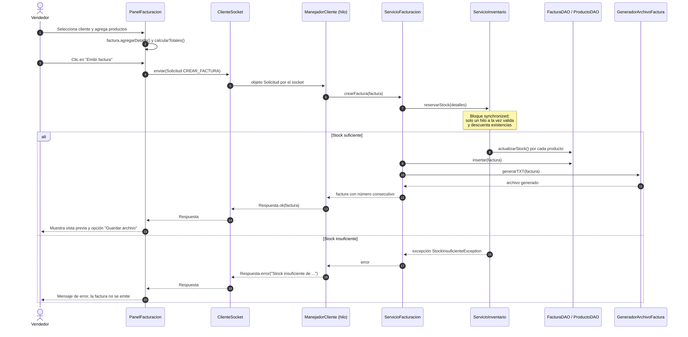

## 4.6 Modelo de la base de datos

La base de datos `fidecompro` guarda todo lo que se hace desde las pantallas. Se diseña para MySQL y funciona igual en Apache Derby. Los tres tipos de producto se guardan en una sola tabla `productos`, con una columna `tipo` y las columnas propias de cada tipo (las que no aplican quedan en `NULL`).

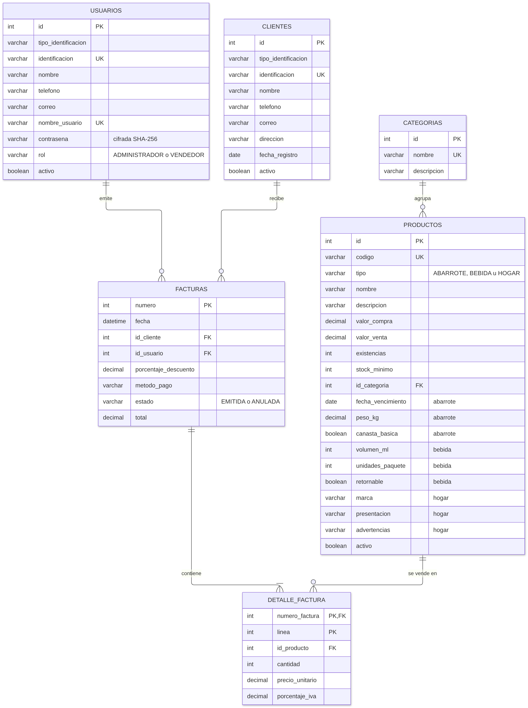

| Tabla | Guarda | Llave primaria | Relaciones |
|---|---|---|---|
| usuarios | Cuentas de acceso con su rol y contraseña cifrada | id | Un usuario emite muchas facturas |
| clientes | Clientes de Fidecompro | id | Un cliente tiene muchas facturas |
| categorias | Categorías del catálogo | id | Una categoría agrupa muchos productos |
| productos | Productos de los tres tipos, con existencias | id | Pertenece a una categoría; aparece en muchas líneas de factura |
| facturas | Encabezado de cada factura | numero | Pertenece a un cliente y a un usuario |
| detalle_factura | Líneas de cada factura con el precio e IVA del momento | numero_factura + linea | Pertenece a una factura y a un producto |

# 5. Historias de usuario

Cada historia sigue el formato *Como un \<rol\>, necesito \<funcionalidad\>, con la finalidad de \<resultado\>* y se acompaña de sus escenarios de aceptación en la forma **Dado que** (contexto), **Cuando** (evento) y **resultado esperado**. Los escenarios cubren el caso exitoso y los errores que el sistema debe controlar.

TABLA_HISTORIAS_USUARIO

## Resumen de las historias

| ID | Historia | Rol | Prioridad | Puntos | Pantalla |
|---|---|---|---|---|---|
| HU 1 | Iniciar sesión | Todos | Alta | 3 | P1 |
| HU 2 | Cerrar sesión | Todos | Alta | 1 | P2 |
| HU 3 | Administrar usuarios | Administrador | Alta | 5 | P8 |
| HU 4 | Registrar cliente | Vendedor | Alta | 3 | P3 |
| HU 5 | Buscar y editar cliente | Vendedor | Alta | 2 | P3 |
| HU 6 | Eliminar cliente | Administrador | Media | 2 | P3 |
| HU 7 | Administrar categorías | Administrador | Alta | 2 | P4, P10 |
| HU 8 | Registrar producto | Administrador | Alta | 3 | P4 |
| HU 9 | Ajustar inventario | Administrador | Alta | 3 | P4 |
| HU 10 | Alertas de stock bajo | Administrador | Media | 2 | P2, P4 |
| HU 11 | Crear factura | Vendedor | Alta | 8 | P5 |
| HU 12 | Facturación simultánea | Administrador | Alta | 5 | P5 |
| HU 13 | Generar factura física | Vendedor | Alta | 3 | P6 |
| HU 14 | Historial de facturas | Todos | Media | 3 | P7 |
| HU 15 | Anular factura | Administrador | Media | 3 | P7 |
| HU 16 | Ventana del servidor | Administrador | Alta | 5 | P9 |

# 6. Prototipos de interfaz gráfica

Los prototipos (bocetos o mockups) representan las ventanas `JFrame` de la aplicación final (look and feel Nimbus): nueve del cliente y una del servidor. Se elaboraron como maquetas HTML/CSS, incluidas en `docs/prototipos/html/`, y se exportaron a imagen. Los datos mostrados son de ejemplo.

Cada clase que el usuario administra tiene su pantalla para crear, consultar, modificar y eliminar:

| Pantalla | Clase que administra | Operaciones |
|---|---|---|
| P1 · Inicio de sesión | `Usuario` | Validar usuario y contraseña |
| P2 · Menú principal | — | Acceso a todos los módulos según el rol |
| P3 · Gestión de clientes | `Cliente` | Crear, consultar, modificar y eliminar |
| P4 · Productos e inventario | `Producto` (`Abarrote`, `Bebida`, `ArticuloHogar`) e `Inventario` | Crear, consultar, modificar, eliminar y ajustar existencias |
| P10 · Gestión de categorías | `Categoria` | Crear, consultar, modificar y eliminar |
| P8 · Gestión de usuarios | `Usuario` | Crear, consultar, modificar y eliminar |
| P5, P6 y P7 · Facturación | `Factura` y `DetalleFactura` | Crear, ver la factura física, consultar el historial y anular |
| P9 · Ventana del servidor | `ServidorFacturacion` | Iniciar, detener y ver clientes conectados |

## 6.1 Mapa de navegación

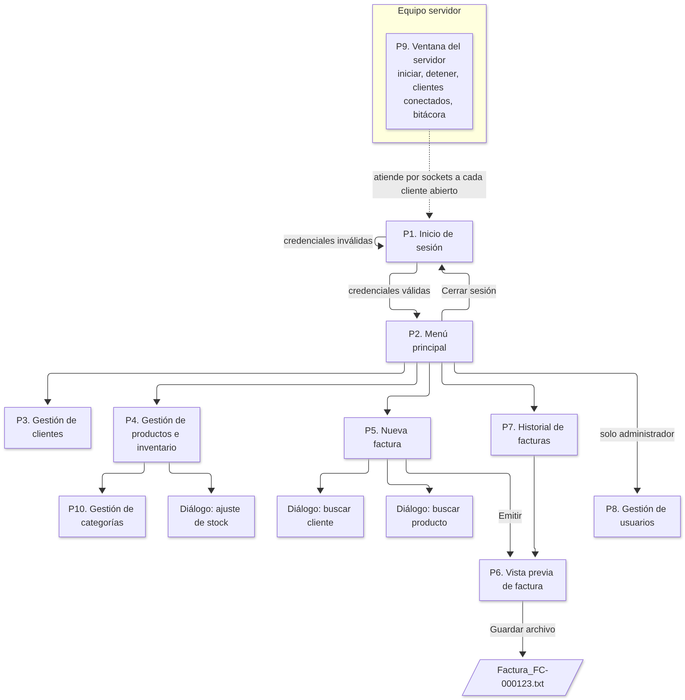

## 6.2 P1 · Inicio de sesión (HU 1)

Campos de usuario y contraseña (oculta), dirección del servidor y mensaje de error ante credenciales inválidas.

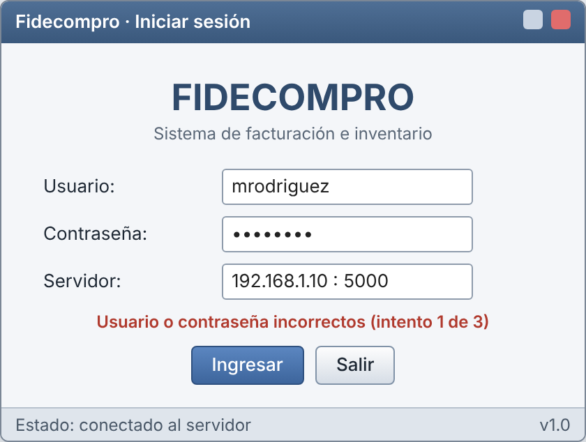

## 6.3 P2 · Menú principal (HU 2, HU 10)

Acceso a todos los módulos mediante menú y botones, resumen del día y alerta de productos bajo el stock mínimo. La barra de estado muestra el usuario, su rol y el estado de la conexión. El botón *Usuarios* solo aparece para administradores.

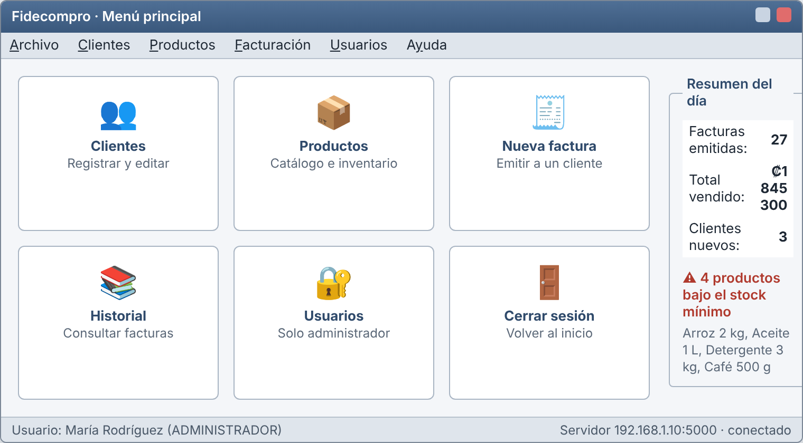

## 6.4 P3 · Gestión de clientes (HU 4, HU 5, HU 6)

CRUD completo de clientes: formulario para crear y modificar, búsqueda, tabla de clientes y botón *Eliminar*. El botón *Actualizar lista* vuelve a pedir los datos al servidor para ver los cambios hechos desde otras cajas.

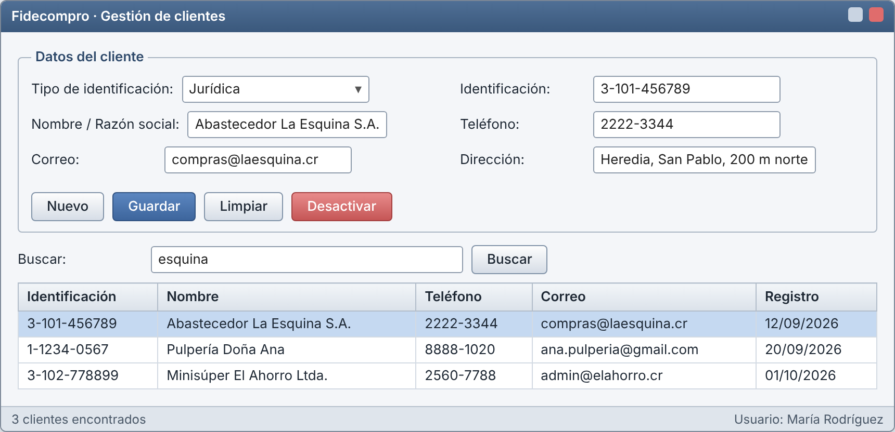

## 6.5 P4 · Productos e inventario (HU 8, HU 9, HU 10)

Pestañas para productos, categorías y productos bajo el mínimo. El formulario cambia según el tipo de producto elegido (abarrote, bebida o artículo del hogar). Los productos bajo el mínimo se resaltan en rojo. Los botones permiten crear, modificar, eliminar y ajustar el stock.

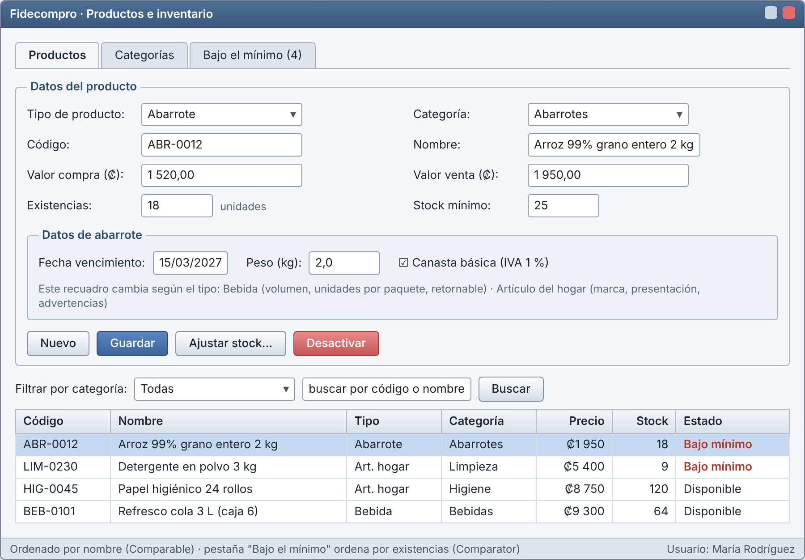

## 6.6 P5 · Nueva factura (HU 11, HU 12)

Selección de cliente, agregado de productos con validación de existencias, tabla de líneas con el IVA de cada tipo de producto, método de pago, descuento y totales calculados.

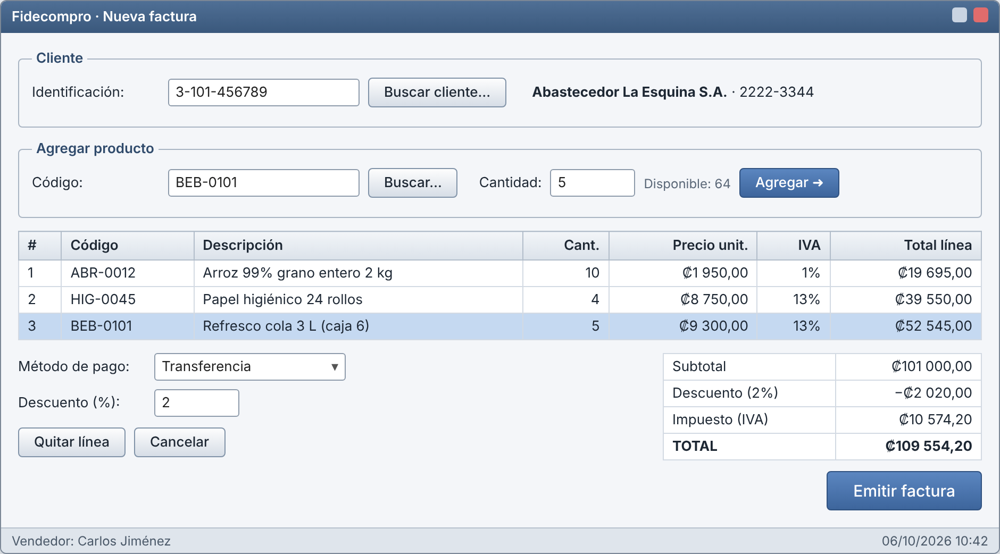

## 6.7 P6 · Vista previa de la factura física (HU 13)

Contenido exacto del archivo que se genera, con el desglose de pago, y botones para guardarlo como `.txt` o `.html`.

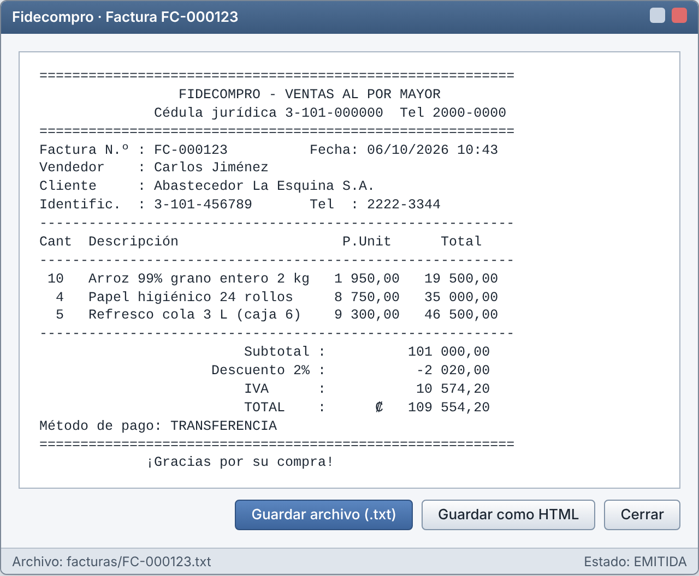

## 6.8 P7 · Historial de facturas (HU 14, HU 15)

Filtros por fecha, cliente y estado; total del periodo y acciones para ver el detalle, regenerar el archivo o anular.

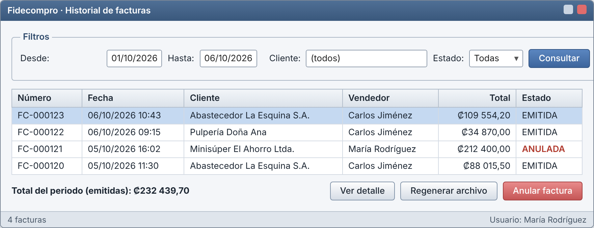

## 6.9 P8 · Gestión de usuarios (HU 3)

Exclusiva del administrador: creación, consulta, modificación (incluido el rol y el estado activo), eliminación y restablecimiento de contraseña de usuarios.

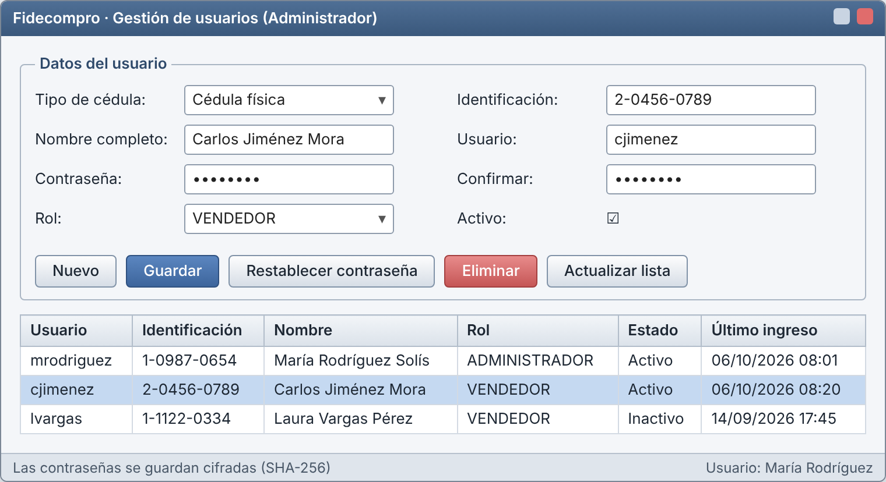

## 6.10 P9 · Ventana del servidor (HU 16)

Se ejecuta en el equipo servidor, aparte de las cajas. Permite elegir el puerto, iniciar y detener el servidor, y muestra los clientes conectados (cada uno con su hilo) y una bitácora con cada operación que llega y su resultado. Es la pantalla que demuestra en el video que el servidor atiende a varios clientes a la vez.

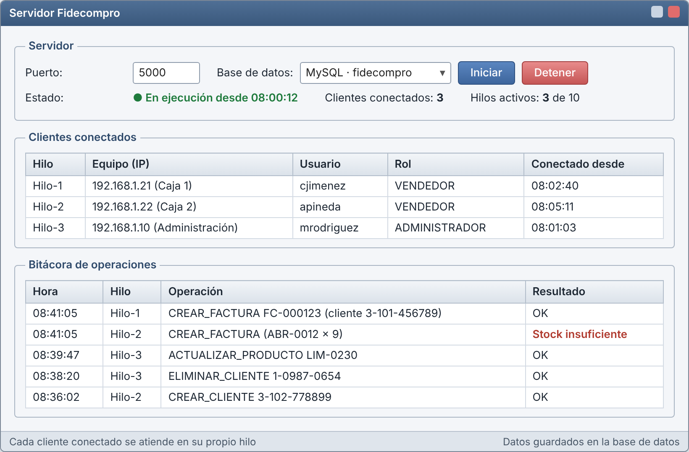

## 6.11 P10 · Gestión de categorías (HU 7)

Se abre desde la pantalla de productos. CRUD de categorías con su nombre y descripción; la tabla indica cuántos productos tiene cada una, porque una categoría con productos no se puede eliminar.

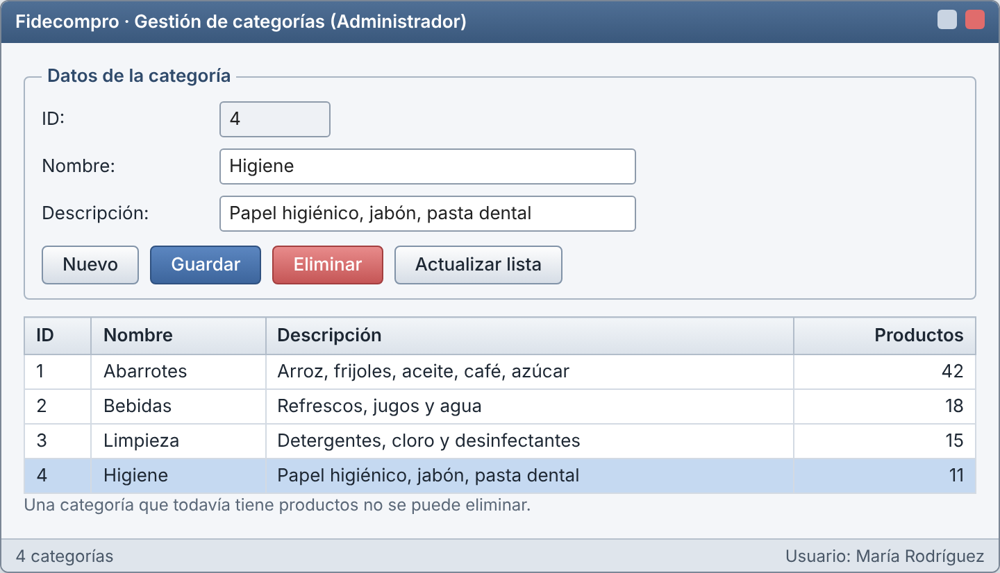

# 7. Trazabilidad historias – clases – pantallas

| Historia | Clases principales | Pantalla |
|---|---|---|
| HU 1, HU 2 | Usuario, RegistroUsuarios, CredencialesInvalidasException, VentanaLogin | P1, P2 |
| HU 3 | Usuario, Rol, RegistroUsuarios | P8 |
| HU 4 a HU 6 | Persona, Cliente, RegistroClientes, RegistroNoEncontradoException | P3 |
| HU 7, HU 8 | Inventario, Categoria, Producto, Abarrote, Bebida, ArticuloHogar | P4, P10 |
| HU 9, HU 10 | Producto, Inventario, ComparadorPorExistencias | P2, P4 |
| HU 11, HU 12 | Factura, DetalleFactura, Inventario, StockInsuficienteException (y en la arquitectura prevista: ServicioFacturacion, ManejadorCliente) | P5 |
| HU 13 | Factura, DetalleFactura, Mostrable | P6 |
| HU 14, HU 15 | Factura, EstadoFactura, RegistroFacturas | P7 |
| HU 16 | VentanaServidor, ServidorFacturacion, ManejadorCliente | P9 |

# 8. Plan de demostración del proyecto final

El video final debe mostrar todas las funcionalidades, el CRUD completo desde las pantallas, que todo queda guardado en la base de datos y que el servidor soporta varios clientes a la vez. Esta matriz muestra qué operación del CRUD tiene cada entidad y en qué pantalla se hace:

| Entidad | Crear | Consultar | Modificar | Eliminar | Pantalla |
|---|---|---|---|---|---|
| Usuarios | Sí | Sí | Sí | Sí (si tiene facturas, se desactiva) | P8 |
| Clientes | Sí | Sí | Sí | Sí (si tiene facturas, se desactiva) | P3 |
| Categorías | Sí | Sí | Sí | Sí (si no tiene productos) | P10 |
| Productos | Sí | Sí | Sí | Sí (si está en facturas, se desactiva) | P4 |
| Facturas | Sí | Sí (historial) | No: una factura emitida no se modifica | Se anula, no se borra | P5, P6, P7 |

Guion previsto para el video:

1. Abrir la ventana del servidor (P9), iniciarlo y mostrar que se conecta a la base de datos.
2. Abrir dos o tres ventanas cliente al mismo tiempo e iniciar sesión con usuarios distintos; mostrar en P9 que cada uno tiene su hilo.
3. Hacer el CRUD de usuarios, clientes, categorías y productos: crear, buscar, modificar y eliminar un registro de cada uno.
4. Después de cada operación, mostrar la tabla correspondiente en la base de datos (MySQL Workbench o la consola de Derby) para comprobar que quedó guardada.
5. Desde otra caja, presionar *Actualizar lista* y mostrar que ve los cambios hechos por la primera.
6. Emitir una factura, ver la vista previa y generar el archivo de la factura física.
7. Facturar el mismo producto desde dos cajas casi al mismo tiempo: una factura sale y la otra recibe el aviso de stock insuficiente, sin existencias negativas.
8. Consultar el historial, anular una factura y mostrar que las existencias vuelven al inventario.
9. Cerrar todo, volver a abrir el servidor y un cliente, y mostrar que los datos siguen ahí.
